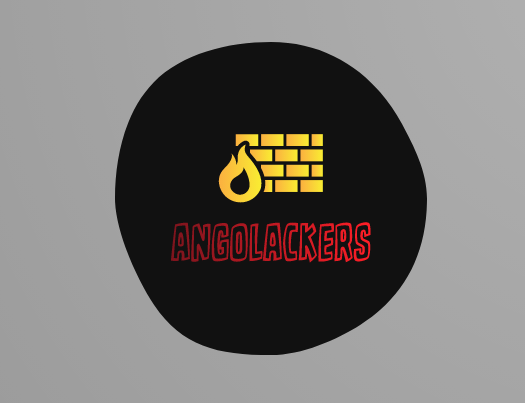

# Angolackers-Academy | Academy_Hackers

    a Academy Hackers (Angolackers) é um colectivo
    de estudantes angolanos de  TI..
    Organizado e gerido por entusiastas e
    viciados pelos seus computadores..
    
    Dedicados principalmente ao estudo de:
    
    - segurança de informação
    - hacking
    - cracking
    - programaçao geral
    
    estes Jovens fazem os possíveis de satisfazer e realizar
    os seus sonhos concernentes a area de TI, na perspectiva
    de contribuir para o desenvolvimento social, acadêmico e econômico
    de seu país..

---

&copy; 2021 ***Academy Hackers (angolan)*** \
&copy; 2021 ***Angolackers***
